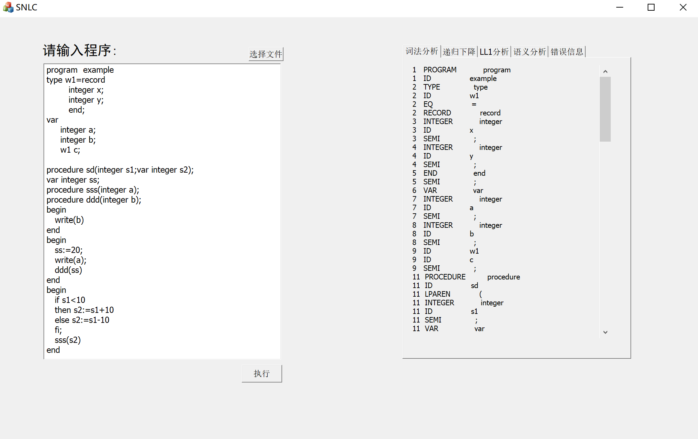

# SNL Analyzer

This is a SNL analyzer for Compiler Principle Course Design based on C++

This project includes a Lex analyzer, a grammar analyzer(realized by both LL1 parser and recursive descent parser), a semantic analyzer and a graphic interface based on MFC.

Run main.cpp and choose a file from testExample or on your own.

Results are as followed:

实现内容包括

- 词法分析

  + 输出Token序列

  + 识别词法错误，包括：

    标识符错误

    不合法字符

    注释缺少后括号

    中文字符（全角字符）
  
- 语法分析
  
+ 递归下降语法分析
  
  + LL1语法分析
  
  + 输出语法树
  
    识别语法错误，包括：
  
    缺少分号
  
    缺少括号
  
    缺少if，else，end等
- 语义分析

  + 生成符号表

  + 识别语义错误，包括

    1. 标识符未定义

    2. 类型未定义

    3. 标识符重复定义

    4. 参数个数不匹配

    5. 参数类型不匹配

    6. 非数组类型引用错误

    7. 赋值号两端类型不同

    8. 运算符两端类型不匹配

    9. 函数未声明

    10. 数组声明越界

    11. 数组使用越界

    12. 域引用错误
- 图形化界面
        

    
